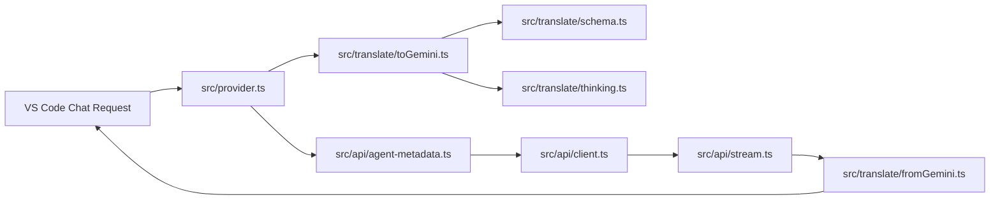

# Antigravity for Copilot Agent Guidelines

VS Code Language Model Chat Provider extension (`vendor: "antigravity"`) bridging Google Antigravity's `v1internal` gateway (Gemini, Claude, GPT-OSS) into native VS Code Copilot Chat.

## Quick Commands

- **Build / Bundle:** `npm run compile` (esbuild output to [dist/extension.js](dist/extension.js))
- **Watch:** `npm run watch`
- **Type Check:** `npm run typecheck` (`tsc --noEmit`)
- **Tests:** `npm test` (runs Vitest unit suite)
- **Full Verification:** `npm run check` (typecheck + tests + compile)
- **VSIX Package:** `npm run package:vsix`
- **Debug / Launch:** Press <kbd>F5</kbd> for Extension Development Host

## Architecture & Data Flow

- **Entry & Lifecycle:** [src/extension.ts](src/extension.ts) wires commands, configuration changes, and registers [src/provider.ts](src/provider.ts) via `vscode.lm.registerLanguageModelChatProvider`.
- **Auth & Tokens:** [src/auth/oauth.ts](src/auth/oauth.ts) runs PKCE server on fixed port `51121`. [src/auth/store.ts](src/auth/store.ts) uses VS Code `SecretStorage`. [src/auth/tokens.ts](src/auth/tokens.ts) handles automatic token refresh. [src/auth/project.ts](src/auth/project.ts) resolves Google Cloud Project IDs.
- **Protocol Translation:** [src/translate/](src/translate/) translates between VS Code `LanguageModelChat*` types and Google Gemini protobuf wire schemas ([src/translate/types.ts](src/translate/types.ts)).
- **Transport & Streaming:** [src/api/client.ts](src/api/client.ts) handles endpoint fallback and auto-retry. [src/api/agent-metadata.ts](src/api/agent-metadata.ts) signs and wraps request payloads. [src/api/stream.ts](src/api/stream.ts) parses SSE response chunks.
- **UI:** [src/ui/manage.ts](src/ui/manage.ts) provides account/quota QuickPick UI; [src/ui/statusBar.ts](src/ui/statusBar.ts) updates quota indicators.

## Critical Conventions & Protocol Quirks

1. **Gemini Dialect for All Models:** Google's gateway expects Gemini `contents[]` format for all models, including Claude and GPT-OSS. Do not send Anthropic-style message envelopes.
2. **Protobuf Schema Restrictions:** The gateway's parser strictly rejects `$ref`, `$defs`, `const`, `default`, and `additionalProperties`. All tool schemas must be normalized in [src/translate/schema.ts](src/translate/schema.ts).
3. **Tool Name Sanitization:** Tool names must conform to `^[A-Za-z_][A-Za-z0-9_.:-]{0,63}$`. Sanitized names must map bi-directionally via `ToolNameMap`.
4. **Tool Call Matching by Name:** Gemini pairs `functionResponse` to previous calls by `name`, not `callId`. Maintain ordered call-to-name mapping when parsing conversation history in [src/translate/toGemini.ts](src/translate/toGemini.ts).
5. **Thinking & Thought Signatures:**
   - Gemini 3 multi-turn tool conversations require echoing back `thoughtSignature`. Since VS Code message history lacks this property, cache signatures in-memory via [src/translate/thinking.ts](src/translate/thinking.ts).
   - `thinkingBudget` must strictly be less than `maxOutputTokens` or the gateway rejects with a 400 error.
6. **OAuth Callback Port:** Redirect URI is pinned to `http://localhost:51121/oauth-callback` in Google OAuth registration. Never change or make port 51121 dynamic.
7. **Clean Headers:** Do not send spoofed or CLI-rotational headers (`X-Goog-Api-Client`, etc.). Keep client headers minimal to prevent signature rejection.

For project context and disclaimer details, see [README.md](README.md).
